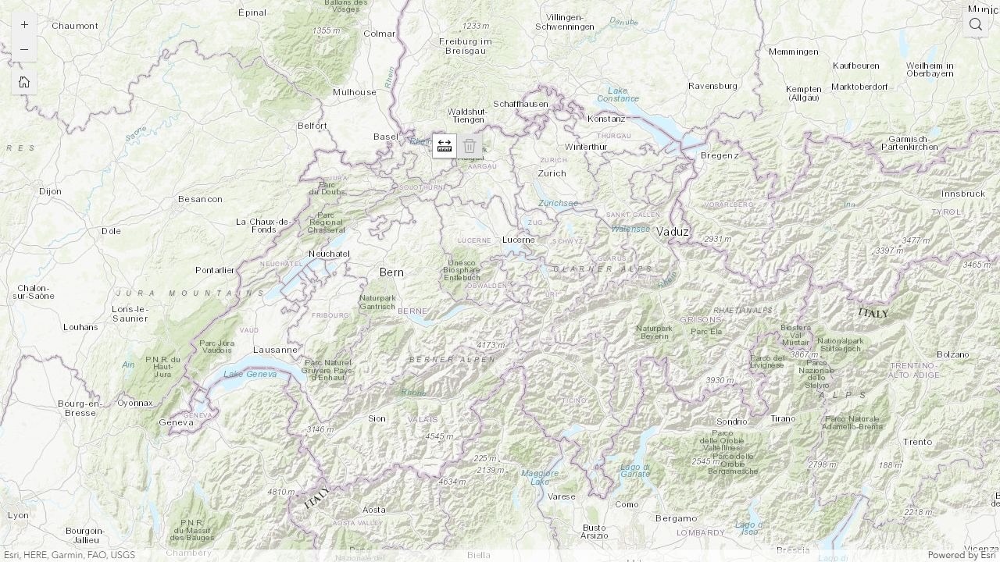
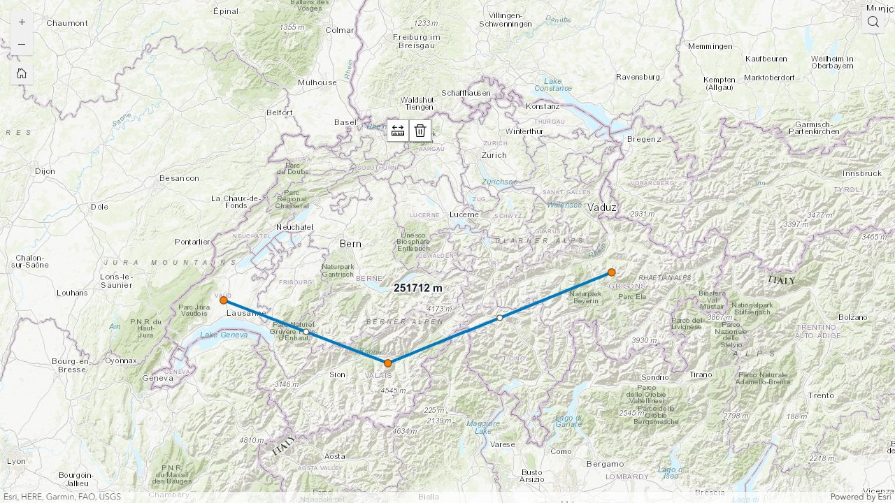
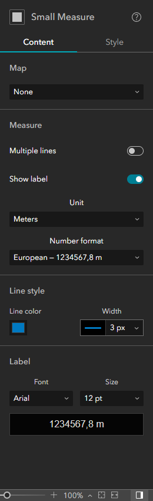

# Small Measure

**Download:** [Small Measure 1.0 for ArcGIS Enterprise 11.5 (ZIP)](https://github.com/ceddc/expb-simple-mesure/releases/download/v1.0/small-measure-v1.0.zip)

Small Measure is a compact distance-measurement widget for ArcGIS Experience Builder. It adds two buttons to a map: one to draw or edit a line, and one to delete the selected measurement.

The ready-to-host release targets ArcGIS Enterprise 11.5.

## Features

- Measures multi-segment lines in meters, kilometres, feet, or miles. Meters are the default.
- Shows the result on the map.
- Supports one measurement or several measurements.
- Lets an app author choose the line color, width, label font, and label size.
- Uses the active Experience Builder language for interface text.
- Formats numbers as European `1234567,8 m` by default, with French, Swiss, and application-locale options.
- Uses English by default and includes 12 additional interface translations.
- Supports the `Delete` key when a measurement is selected.

## Screenshots

### Runtime layout



The compact toolbar can be placed wherever it fits the experience. Here it is above the map content, away from the zoom, home, and search controls.

### Completed measurement



### Builder settings



Settings at a glance:

- **Map** connects Small Measure to a Map widget.
- **Multiple lines** keeps earlier measurements instead of replacing them.
- **Show label** displays the distance on the map.
- **Unit** chooses meters, kilometres, feet, or miles. Meters are the default.
- **Number format** controls the thousands and decimal separators.
- **Line color and width** style the measured line.
- **Font and size** style the distance label.

## Install

Small Measure can be registered once and then used as a custom widget in the customer's built-in ArcGIS Enterprise 11.5 Experience Builder.

1. Copy the ready-to-host [`release/small-measure`](release/small-measure) folder to an HTTPS web server.
2. In the customer portal, an administrator adds an **Application** item of type **Experience Builder widget** using the hosted `manifest.json` URL.
3. Share the widget item with the customer group or organization that needs it.
4. In the built-in Enterprise Experience Builder, add **Small Measure** from the **Custom** widget group and connect it to a Map widget.

The web server must allow anonymous HTTPS access, return JSON with the `application/json` MIME type, and allow cross-origin requests from the customer portal. The repository source or a source ZIP is not uploaded directly to Portal.

See [Deploy to ArcGIS Enterprise 11.5](docs/site/install.md) for the complete customer workflow. It follows Esri's official [Add custom widgets](https://doc.arcgis.com/en/experience-builder/11.5/configure-widgets/add-custom-widgets.htm) instructions.

## Use

Select the measure button, then click the map to draw a line. Double-click to finish. Drag a vertex to adjust the result. Use the trash button or the `Delete` key to remove the selected line.

### Number separators

| Format | Thousands separator | Decimal separator | Example |
| --- | --- | --- | --- |
| European (default) | None | Comma | `1234567,8 m` |
| French | Non-breaking space | Comma | `1 234 567,8 m` |
| Swiss | Apostrophe | Dot | `1'234'567.8 m` |
| Application locale | Active locale | Active locale | Varies with Experience Builder |

### Interface languages

English is the default. The widget also includes French, German, Spanish, Italian, Brazilian Portuguese, Dutch, Polish, Czech, Danish, Swedish, Norwegian Bokmål, and Finnish.

See the short guides in [`docs/site`](docs/site):

- [Overview](docs/site/overview.md)
- [Deploy to ArcGIS Enterprise 11.5](docs/site/install.md)
- [Use and settings](docs/site/use-and-settings.md)
- [Troubleshooting](docs/site/troubleshooting.md)

## Check the project

Node.js 22 is used for the repository's small validation and documentation scripts. They do not build Experience Builder itself.

```sh
npm run verify
```

To generate the local documentation site:

```sh
npm run docs:build
```

Open `dist/docs-site/index.html` after the build.

## Contributing

Issues and focused pull requests are welcome. Keep the project limited to the Small Measure widget, keep English as the default locale, and run `npm run verify` before opening a pull request.

## License

The source code in this repository is available under the [MIT License](LICENSE). MIT is short and permissive: you may use, modify, and redistribute the code as long as the copyright and license notice remain with it.

The MIT License applies only to this repository. ArcGIS and ArcGIS Experience Builder are Esri products, are not included here, and remain subject to Esri's terms.
